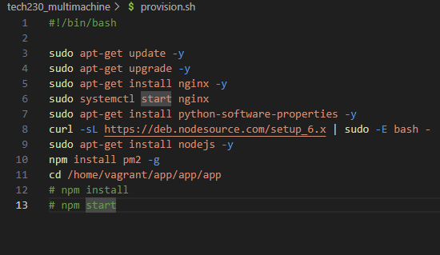
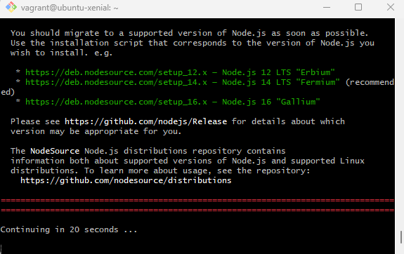
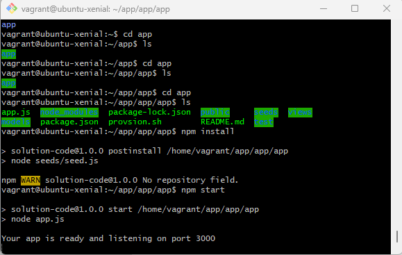
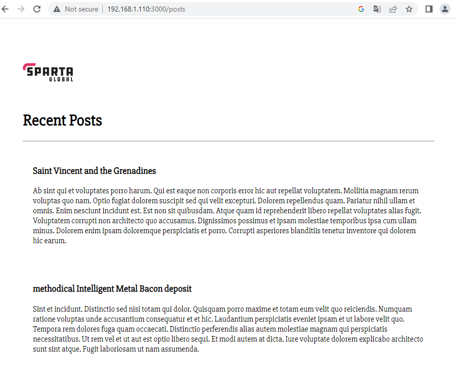

# A Guide on how to deploy the Sparta App

## Pre Deployment Configuration

As we'll be deploying the Sparta App using 2 virtual Machines we will need to add some configuration in the Vagrantfile. We will require 2 `do` blocks in our code.

### Steps for configuring the 'app' machine are as follows:

1. Add the lines below to configure vm settings:

    * `app.vm.box = "ubuntu/bionic64"`
    * `app.vm.network "private_network", ip:"192.168.1.110"`

2. Add `app.vm.provision "shell", path: "provision.sh"` to provision the VM to have nginx and run the shell script
3. Add `app.vm.synced_folder "app", "/home/vagrant/app/app"` to put the app folder from local machine to the VM

The app do block should look like this:

### Steps for configuring the 'db' machine are as follows:

1. Add the lines below to configure vm settings:

    * `db.vm.box = "ubuntu/bionic64"`
    * `db.vm.network "private_network", ip: "192.168.1.150"`

2. Add `db.vm.provision "shell", path: "provision.sh"` to provision the VM to have nginx and run the shell script
3. Add `db.vm.synced_folder "environment", "/home/vagrant/environment"` to put the environment folder from local machine to vm

The db do block should look like this:

## Running the VM

Follow the steps below to setup your Virtual Machine before deploying the app. Open to Bash terminals and run the following commands

1. `vagrant destroy` (This will delete any existing virtual machine and it's files within current directory)

2. `vagrant up` (creates two new new virtual machines. you can check this in virtual box to make sure a new virtual machines with appropriate name are added)

3. `vagrant ssh app`. This will allow you to enter the app virtual machine that was just created.
NOTE: working directory in bash terminal will change to `vagrant@ubuntu/bionic64` or any other box you have configured for in Vagrantfile.

4. `vagrant ssh db`. This will allow you to enter the app virtual machine that was just created.
NOTE: working directory in bash terminal will change to `vagrant@ubuntu/bionic64` or any other box you have configured for in Vagrantfile.

## Creating a MongoDB Server

You will need to create a mongodb server in your `db` vm before two machines can be connected and app is to be run. Follow the steps below to do this:

1. `sudo apt-key adv --keyserver hkp://keyserver.ubuntu.com:80 --recv D68FA50FEA312927`
2. `echo "deb https://repo.mongodb.org/apt/ubuntu xenial/mongodb-org/3.2 multiverse" | sudo tee /etc/apt/sources.list.d/mongodb-org-3.2.list`
3. `sudo apt-get update -y`
4. `sudo apt-get upgrade -y`
5. `sudo apt-get install -y mongodb-org=3.2.20 mongodb-org-server=3.2.20 mongodb-org-shell=3.2.20 mongodb-org-mongos=3.2.20 mongodb-org-tools=3.2.20`
6. `sudo systemctl start mongod`
7. `sudo systemctl enable mongod`
8. `sudo systemctl status mongod`

You will get a status confirmation like the one below to confirm server is live:

# Deploying the dynamic webpage and connecting the two VM's

To deploy a dynamic webpage that fetches data from a mongodb database, we need to follow the steps as below to create a connection between two virtual machines.

In `db` virtual machine, run:

1. `sudo nano /etc/mongod.conf`
2. find `#network interfaces` within the page and change `bingip` to `0.0.0.0`
3. `sudo systemctl restart mongod`
4. `sudo systemctl enable mongod`

In `app` virtual machine, run:

1. `printenv`
2. `sudo nano .bashrc` and add `export DB_HOST=mongodb://192.168.1.150:27017/posts`
3. `source .bashrc`
4. `sudo apt install npm`
5. `node seeds/seed.js`
6. `node app.js`

### Check App is deployed

* In your web browser, enter `192.168.1.110:3000/posts` and you should a dynamic web page that looks like this:

## Deploying the App (Auotmated Process)

To Automate the deployment, we will need to add additional scripting to our provision file to install node and other relevant packages:

* `sudo apt-get install python-software-properties -y` - Install python properties
* `curl -sL https://deb.nodesource.com/setup_6.x | sudo -E bash -`
* `sudo apt-get install nodejs -y` - Install nodejs
* `npm install pm2 -g` - Install pm2 process manager
* `cd /home/vagrant/app/app/app` - Enter's relevant directory
* `npm install` - Installs npm
* `npm start` - Runs the App

The new provision file should look like this:

## Deploying the App (Manual Process)

1. `sudo apt-get install python-software-properties`
2. `curl -sL https://deb.nodesource.com/setup_6.x | sudo -E bash -`. It should look like this and it will prompt you to run command in step 3 after execution.

3. `sudo apt-get install nodejs -y` - To installl nodejs

4. In VM, run `cd app` to make sure all app files are accessible.
5. `npm install` - This will install node package manager to ensure all required package for running the app are downloaded.
6. `npm start` - To run the app, you should see the following message in your VM terminal:

7. `192.168.1.110` - Nginx web server can be accessed by entering this IP address in the web browser.

8. `192.168.1.110:3000` - Deployed version of the app can be viewed by entering this address in the browser. This should look like this:

## How to setup a reverse proxy

In your app virtual machine, run following commands:

1. `sudo nano /etc/nginx/sites-available/default` and scroll to `location` code block.
2. In `location` block, add `proxy_pass http://localhost:3000;`
3. In `location` block, add `proxy_set_header Host $host;`
4. Change `server_name` to `192.168.1.110`

This should look like this:

5. Run `sudo nginx -t` to check for syntax errors
6. Run `sudo systemctl restart nginx` to restart nginx
7. Enter `192.168.1.110` in web browser to view the deployed app.